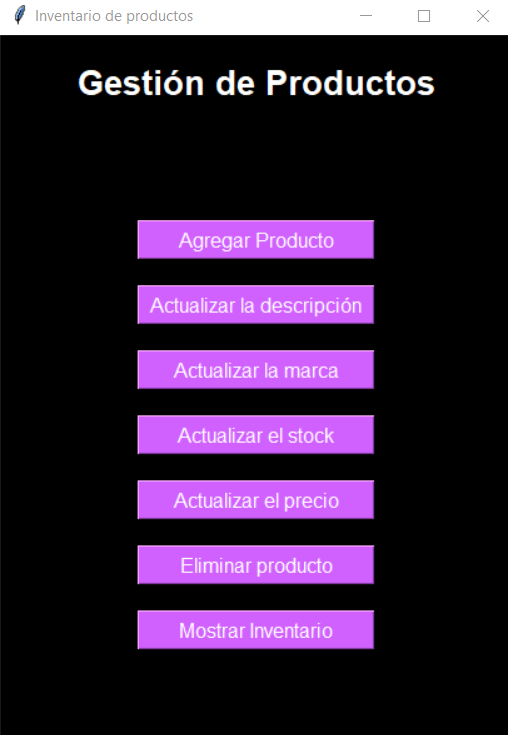
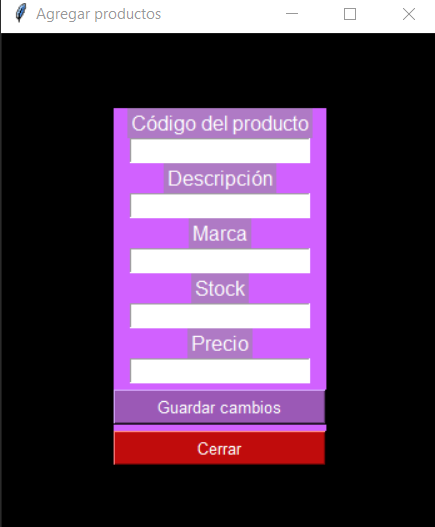
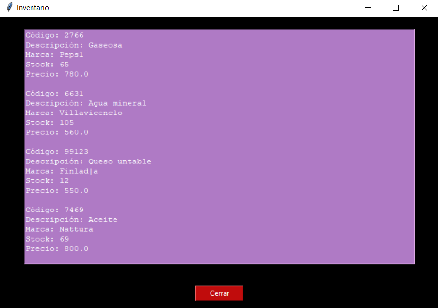

# Inventario con Tkinter y SQLite

Este es un proyecto de ejemplo que muestra cómo crear una aplicación de inventario utilizando la biblioteca Tkinter para la interfaz gráfica y SQLite para la gestión de la base de datos.

## Descripción

Este proyecto consiste en una aplicación de inventario que permite agregar, visualizar y gestionar productos en una interfaz gráfica simple. Los productos se almacenan en una base de datos SQLite, lo que facilita su almacenamiento y recuperación.

## Características

- Agregar productos al inventario con información como código, descripción, marca, stock y precio.
- Visualizar todos los productos en el inventario.
- Validación de datos para asegurar la consistencia de la información ingresada.
- Interfaz de usuario intuitiva y amigable.

## Capturas de Pantalla

A continuación, algunas capturas de pantalla de la aplicación:

*Menu principal:*

*--------------------------------------------------------------------------------*

*Agregar nuevos productos al inventario:*

*--------------------------------------------------------------------------------*

*Visualización del inventario completo:*

## Requisitos

- Python 3.x
- Biblioteca Tkinter (generalmente incluida en las distribuciones de Python)
- Biblioteca SQLite3 (generalmente incluida en las distribuciones de Python)

## Instalación y Uso

1. Clona este repositorio en tu máquina local.
2. Asegúrate de tener Python 3.x instalado.
3. Ejecuta el script `TkinterInventario.py` para iniciar la aplicación.
4. Sigue las instrucciones en la interfaz de usuario para agregar productos

